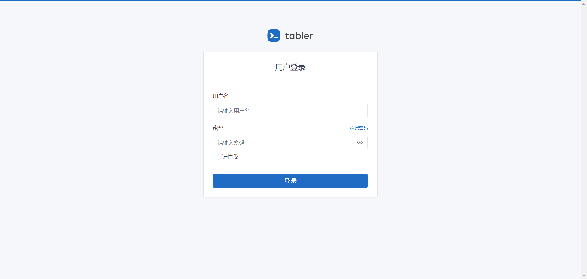
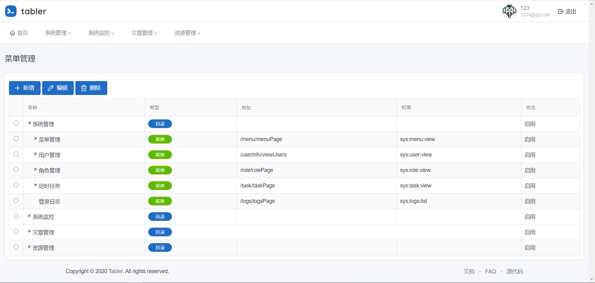
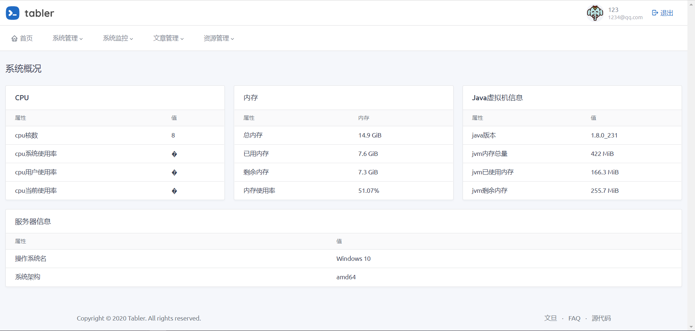
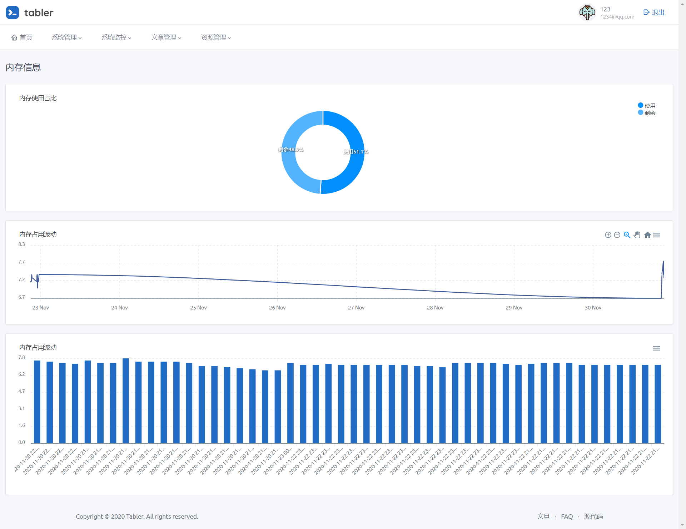
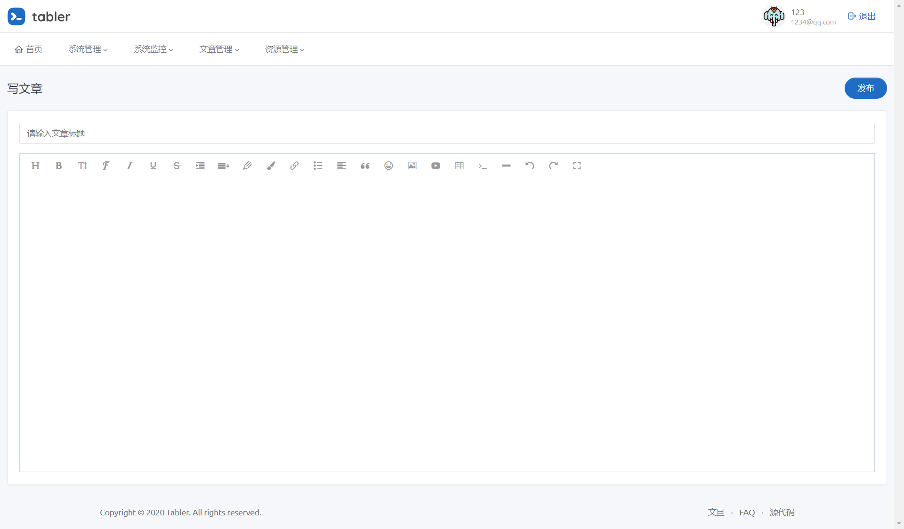

# 蓝创官网项目

### 前台地址
* 首页 
http://localhost:8087/page/index.html
* 关于蓝创
http://localhost:8087/page/about.html
* 产品与服务
http://localhost:8087/page/service.html
* 解决方案
http://localhost:8087/page/solution.html
* 人力资源
http://localhost:8087/page/humanResource.html
* 蓝创成员
http://localhost:8087/page/team.html
* 合作伙伴
http://localhost:8087/page/partner.html
* 关于我们
http://localhost:8087/page/contact.html

### 后台地址
* http://localhost:8087/
* 账号123密码123

### 数据库mysql
* username: root
* password: 123456
* 124.71.156.219
* 40001

### 配置文件
application.yml

### 以下为原始cms项目readme
### 项目说明

* 基于SpringBoot的网站内容管理系统
* 可视化的管理定时任务
* model、mapper、mapper.xml代码生成器
* 系统运行监控

### 功能概述
* 用户管理
* 角色管理
* 定时任务管理
* 基于MinIO的文件管理
* 基于Quartz的定时任务管理
* 登录日志管理
* 邮箱重置密码

### 使用
#### 项目启动
在bin目录下执行脚本即可
#### 登录
* 用户名：123
* 密码：123

### 技术选型
#### 后端
* SpringBoot框架
* Thymeleaf模板引擎
* Quartz定时任务
* Shiro安全框架
* Knife4j文档工具
* MinIo存储服务
* Oshi
* HuTool工具集
* 通用Mapper插件
* PageHelper分页插件
* lombok

#### 前端
* wangeditor编辑器
* Ztree树形组件
* LayUI弹出层
* Table框架
* ...

### 系统截图
* 登录

* 菜单管理

* 系统概况

* 系统运行波动

* 文章编辑

